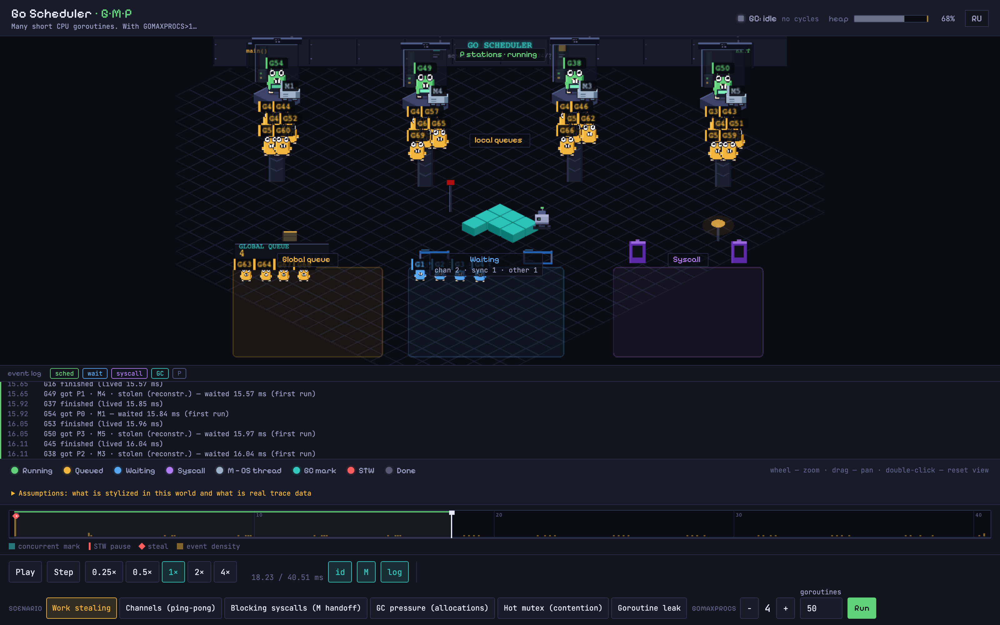

# gmp-model — Go Scheduler (G·M·P) & GC Visualizer

**English** · [Русский](README_RUS.md)

[](https://github.com/puddingtonnn/go-scheduler-live/actions/workflows/pages.yml)

An educational, pixel-art visualization of the **real** Go runtime scheduler: goroutines (G) as gophers, execution slots (P) as isometric stations, OS threads (M) as numbered carriers — plus the garbage collector, live heap, work stealing, blocking syscalls and stop-the-world pauses.



## The source of truth is the real runtime

This is **not a simulation**. The backend runs curated Go workloads in a subprocess under [`runtime/trace`](https://pkg.go.dev/runtime/trace), parses the binary trace with [`golang.org/x/exp/trace`](https://pkg.go.dev/golang.org/x/exp/trace), and normalizes it into a timeline the frontend replays on a virtual clock. Every event you see — goroutine state transitions, P and M bindings, GC cycles, sub-millisecond STW durations, heap metrics, block reasons — comes from an actual trace of an actual Go program that ran on your machine seconds ago.

Where the trace does not record something (local run-queue membership, steals, M lifecycle), the world reconstructs it honestly: reconstructions are marked `(reconstr.)` in tooltips and the log, and the always-visible **Assumptions** panel under the legend lists exactly what is stylized and what is fact.

## Features

- **Six curated scenarios** — work stealing, channel ping-pong, GC pressure, blocking syscalls (M handoff by sysmon), hot mutex contention, goroutine leak — each traced live with your `GOMAXPROCS` and goroutine count.
- **Real OS threads (M).** The trace carries the executing thread id on every event; carriers dock at P stations and leave with their goroutine into blocking syscalls. Watch sysmon retake a P from a kernel-stuck M.
- **Real GC.** A to-scale GC strip (concurrent-mark bands + STW ticks), per-frame heap bar colored by GC phase, and an STW flash that reports the honest pause duration (microseconds, not the stretched animation).
- **Event log with causality** — every trace event with who-woke-whom, wait/run/kernel durations, syscall-return-without-P and sysmon-retake correlation, derived strictly from trace facts.
- **floor796-style zoom & pan** — wheel to zoom up to 6×, goroutine id tags re-rasterize and stay crisp.
- **RU/EN interface** — a header toggle switches the whole UI, including captions and the event log.
- **Shareable URLs** — scenario, parameters and the paused playhead moment encode into the address bar.
- **Static demo mode** — a baked matrix of traces deploys to GitHub Pages with no backend at all.

## Scenarios

| Scenario | What it teaches |
|---|---|
| Work stealing | With `GOMAXPROCS>1`, idle Ps steal goroutines from busy ones |
| Channels (ping-pong) | A ring of goroutines passes tokens; most wait on `chan receive` |
| GC pressure | Fast allocation drives GC cycles: concurrent mark + stop-the-world |
| Blocking syscalls | The M blocks in the kernel with its G; sysmon retakes the P for another M |
| Hot mutex | One `sync.Mutex` serializes N workers no matter how many Ps exist |
| Goroutine leak | Goroutines block forever on a channel nobody writes to; Waiting only grows |

## How it works

```
cmd/workload (subprocess, runtime/trace on stdout)
      │  binary trace
      ▼
internal/tracerun  ──►  internal/traceparse  ──►  internal/timeline   ──►  internal/api
   run → bytes           x/exp/trace → events      domain model/DTO         HTTP/JSON
                                                                              │
                                                              web/ (Vite + TypeScript + PixiJS)
                                                    player/ (pure stateAt(t) + virtual clock)
                                                    scene/  (isometric pixel world, zoom/pan)
                                                    ui/     (DOM chrome, event log, i18n)
```

- The trace is captured in a **separate subprocess** — the server's own goroutines never pollute it, and `GOMAXPROCS` is set per run.
- Scenarios pace themselves with CPU work (`busyFor`), never `time.Sleep` — sleeping parks goroutines and empties the world; unpaced channel scenarios generate millions of events.
- Pure logic (state folding, GC summary, layout, causality log, viewport math, i18n) is unit-tested; the visual layer is verified by Playwright harnesses, including a 26-point control contract.

## Quick start

Prerequisites: **Go 1.25+**, **Node 20+**.

```bash
# backend (terminal 1)
go run ./cmd/server -addr :8085

# frontend (terminal 2)
cd web
npm install
GMP_API_TARGET=http://localhost:8085 npm run dev
```

Open http://localhost:5173. Each **Run** records a fresh trace of the selected scenario.

### Static build (no backend)

```bash
go run ./cmd/bake                 # bakes web/public/runs/*.json
cd web
VITE_STATIC=1 npm run build       # frontend serves the baked matrix
npx vite preview
```

The same pipeline deploys to GitHub Pages on every push to `main` (`.github/workflows/pages.yml`).

## Testing

```bash
go test ./...                     # scheduler invariants incl. M bindings, scenario anti-regressions
cd web && npx vitest run          # pure logic: state, GC, layout, causality, share codec, viewport, i18n
node scripts/verify-controls.mjs  # Playwright: 26-point control contract (needs both servers running)
```

## Honesty notes

The in-app **Assumptions** panel is the authoritative list. In short: queue membership and steals are reconstructions (marked as such), time is slowed thousands of times, a P lane shows 6 goroutines instead of the real 256-slot queue, `runnext` is not drawn, GC sweep/mark-assist and the mark workers' ~25% CPU are omitted, parked M's are invisible because the trace has no M lifecycle. Everything else is real trace data.
